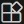

# VSCode Docs 정리 중

## 마켓플레이스 언어 팩 (Marketplace Language Packs)

 확장 - `Korean Language Pack for Visual Studio Code`, Microsoft

### 💠 레이아웃 사용자 지정

- 전체 화면 ⌨️ `F11`
- Zen 모드 ⌨️ `Ctrl+K` `Z`

---

🔹 표시 언어 변경 (Changing the Display Language)
> 🎨 명령팔레트 - `Configure Display Language` - `ko` 선택 - 재시작

## 마켓플레이스 언어 팩 (Marketplace Language Packs)

  확장 - `Korean Language Pack for Visual Studio Code`, Microsoft

 